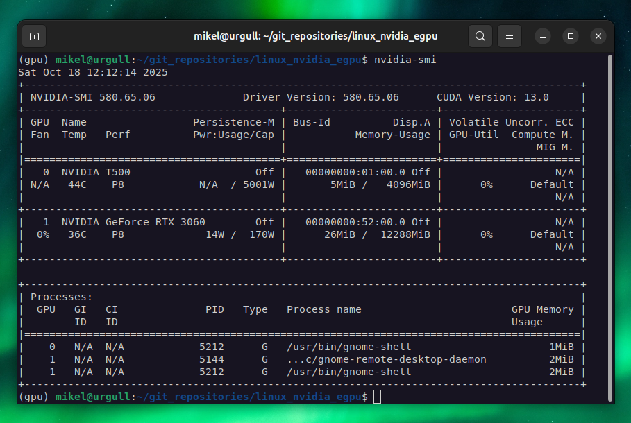

# eGPU Blog Post

<!--
# Log in/out to Docker Hub
docker logout
docker login

# Pull the official image (first time)
docker pull excalidraw/excalidraw

# Start app
docker run --rm -dit --name excalidraw -p 5000:80 excalidraw/excalidraw:latest
# Open browser at http://localhost:5000

# Stop
docker stop excalidraw
docker rm excalidraw
docker ps
-->

Title: My Personal eGPU Server Setup  
Subtitle: How to Run and Train LLMs Locally with NVIDIA Chips from a Mac & Linux 

You have propably followed the release of the [NVIDIA DGX Spark](https://www.nvidia.com/en-us/products/workstations/dgx-spark/) *personal supercomputer*. The device, with 128 GB of memory, 20 CPU cores, and a price of USD $3,999.00, will be definitely on the whish list of any AI nerd for this Christmas.

This blog post is my personal and humble alternative. Indeed, in the past 2 years I have been using a NVIDIA eGPU from my Macbook M1, but via a Linux machine, which plays the role of a server. Since some colleagues and friends showed interest, I decided to [**thoroughly document it on Github**](https://github.com/mxagar/linux_nvidia_egpu) and to write this blog post, which explains overall the setup and the motivation behind it. Here's the schematics of my *supercomputer*:

I mainly use the GPU to train general Deep Learning models (with [VSCode Remote Development](https://code.visualstudio.com/docs/remote/ssh)) and to run LLMs locally (with [Ollama](https://ollama.com/)); as you can see in the picture above:

- I have a [Lenovo ThinkPad P14s](https://www.lenovo.com/gb/en/p/laptops/thinkpad/thinkpadp/p14s-amd-g1/22wsp144sa1) with an integrated NVIDIA Quadro T500 graphics card running Ubuntu.
- I attach to a Thunberbolt port of the Lenovo a [Razer Core X External Case](https://www.razer.com/mena-en/gaming-laptops/razer-core-x) which contains a [NVIDIA GeForce RTX 3060](https://www.gigabyte.com/Graphics-Card/GV-N3060GAMING-OC-12GD-rev-20) with 12 GB of memory.
- I run applications which require GPU power on the Lenovo/Ubuntu but interface with them via my MacBook Pro (M1).

You might ask *why I would want to run and train models locally*, since we have many cloud services available that spare us with the hustle. Here're my answers:

- Many models (LLMs or any other DL networks) can be used locally for a **fraction of the cost** required by cloud providers; in fact, the [NVIDIA RTX 3060](https://www.nvidia.com/en-us/geforce/graphics-cards/30-series/rtx-3060-3060ti/) with 12 GB is quite similar to the often offered low tier GPU, the [NVIDIA T4](https://www.nvidia.com/en-us/data-center/tesla-t4/).
- <elaborate> Use data **confidentially**: personal documents, corporate documents with export protection, etc. </elaborate>
- <elaborate> **Learn** how to set up hardware, firmware software. </elaborate>
- <elaborate> **Avoid dependence** on cloud services. </elaborate>

You might also ask *why not stick to a single computer, Ubuntu or MacOS, with an attached eGPU*; 

## Setup

Summary of steps

## Usage

[test_gpu.ipynb](https://github.com/mxagar/linux_nvidia_egpu/blob/main/test_gpu.ipynb)

Macbook vs NVIDIA comparison

VSCode

Ollama

