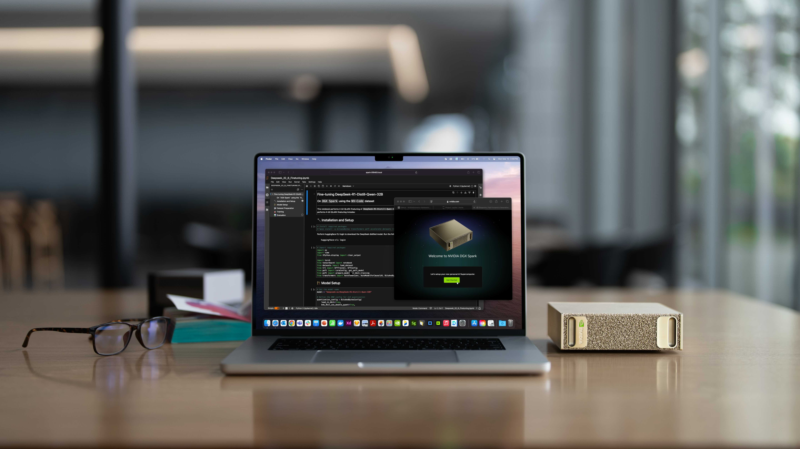
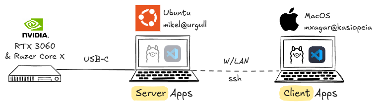
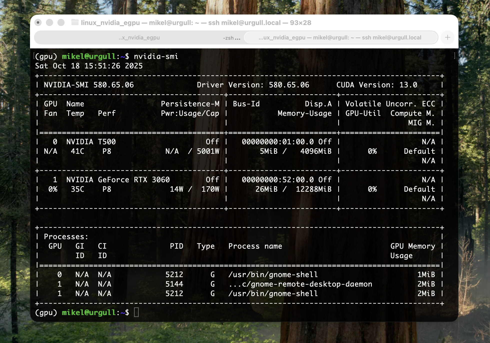

# eGPU Blog Post

<!--
# Log in/out to Docker Hub
docker logout
docker login

# Pull the official image (first time)
docker pull excalidraw/excalidraw

# Start app
docker run --rm -dit --name excalidraw -p 5000:80 excalidraw/excalidraw:latest
# Open browser at http://localhost:5000

# Stop
docker stop excalidraw
docker rm excalidraw
docker ps
-->

Title: My Personal eGPU Server Setup  
Subtitle: How to Run and Train LLMs Locally with NVIDIA Chips from a Mac & Linux 



This blog post is not about the [NVIDIA DGX Spark](https://www.nvidia.com/en-us/products/workstations/dgx-spark/). Instead, it's about my eGPU setup, the *personal supercomputer* I've been using the past 2 years. Image from [NVIDIA](https://nvidianews.nvidia.com/news/nvidia-dgx-spark-arrives-for-worlds-ai-developers)

You have maybe followed the release of the [NVIDIA DGX Spark](https://www.nvidia.com/en-us/products/workstations/dgx-spark/) *personal supercomputer*. The device, with 128 GB of memory, 20 CPU cores, and a price of USD $3,999.00, will be definitely on the wish list of any AI nerd for this Christmas.

This blog post is my personal and humble alternative. Indeed, in the past 2 years I have been using an NVIDIA eGPU (external GPU) from my MacBook M1, but via a Linux machine, which plays the role of a server. Since some colleagues and friends showed interest, I decided to [**thoroughly document it on Github**](https://github.com/mxagar/linux_nvidia_egpu) in the form of the guide I was looking for, but couldn't find completely. On the other hand, this blog post introduces the overall setup and the motivation behind it. Here's the schematics of my *supercomputer*:



I mainly use the eGPU to train general Deep Learning models (with [VSCode Remote Development](https://code.visualstudio.com/docs/remote/ssh)) and to run LLMs locally (with [Ollama](https://ollama.com/)); as you can see in the picture above:

- I have a [Lenovo ThinkPad P14s](https://www.lenovo.com/gb/en/p/laptops/thinkpad/thinkpadp/p14s-amd-g1/22wsp144sa1) with an integrated NVIDIA Quadro T500 graphics card running Ubuntu.
- I attach to a Thunderbolt port of the Lenovo a [Razer Core X External Case](https://www.razer.com/mena-en/gaming-laptops/razer-core-x) which contains a [NVIDIA GeForce RTX 3060](https://www.gigabyte.com/Graphics-Card/GV-N3060GAMING-OC-12GD-rev-20), with 12 GB of memory.
- I run applications which require GPU power on the Lenovo/Ubuntu but interface with them via my MacBook (M1).

You might ask *why I would want to run and train models locally*, since we have many cloud services available that spare us with the hustle. Here're my answers:

- Many models (LLMs or any other DL networks) can be used locally for a **fraction of the cost** required by cloud providers; in fact, the [NVIDIA RTX 3060](https://www.nvidia.com/en-us/geforce/graphics-cards/30-series/rtx-3060-3060ti/) with 12 GB is quite similar to the often offered low tier GPU, the [NVIDIA T4](https://www.nvidia.com/en-us/data-center/tesla-t4/).
- <elaborate> Use data **confidentially**: personal documents, corporate documents with export protection, etc. </elaborate>
- <elaborate> **Avoid dependence** on cloud services. They can increase prices or fail at any moment. Examples are when [AWS went down in December 2021](https://techcrunch.com/2021/12/07/amazon-web-services-went-down-and-took-a-bunch-of-the-internet-with-it/) or the more recent [AWS outage in October 2025](https://www.wired.com/story/what-that-huge-aws-outage-reveals-about-the-internet/) </elaborate>
- <elaborate> **Learn** how to set up hardware, firmware, software. </elaborate>

You might also ask *why not stick to a single computer, Ubuntu or MacOS, with an attached eGPU*. The question has several layers:

- Even though I really like Ubuntu, MacOS offers in my opinion another level of use experience in general, which is more advanced the the Linux variant.
- In the past, Intel-based Macs supported AMD eGPUs, but since the introduction of the Apple M1, that option seems to have vanished. 
- My preferred choice would be a MacOS with NVIDIA eGPU support, because NVIDIA chips are the industry standard.
- Another option would be to upgrade my MacBook Pro M1 to a MacStudio M3 Ultra or similar, which comes with a very powerful processor -- but why should I leave aside my perfectly working M1?

## Setup Guide

The [Github repository I have created](https://github.com/mxagar/linux_nvidia_egpu) covers all the questions and technical steps necessary to get up and running an eGPU:

- [Hardware requirements](https://github.com/mxagar/linux_nvidia_egpu/tree/main?tab=readme-ov-file#step-0-hardware-requirements): *What hardware do I need for an eGPU setup? Which GPUs and enclosures are compatible? How much VRAM do typical ML models require?*
- [Installation of Ubuntu](https://github.com/mxagar/linux_nvidia_egpu/tree/main?tab=readme-ov-file#step-1-install-ubuntu) and [NVIDIA libraries](https://github.com/mxagar/linux_nvidia_egpu/tree/main?tab=readme-ov-file#step-3-install-and-configure-nvidia-and-gpu-related-libraries): *How do I install and configure Ubuntu so it works smoothly with my external NVIDIA GPU?*

Additionally, some extra but very practical aspects are covered in dedicated sections:

- [Installation of Docker with GPU support](https://github.com/mxagar/linux_nvidia_egpu/tree/main?tab=readme-ov-file#step-5-install-docker-with-nvidia-gpu-support): Containerization has become crucial in the AI/ML industry; unfortunately, setting up deep learning or model-serving workloads inside images with full GPU acceleration is sometimes not that straightforward -- fear not: a simple yet working recipe is provided in this section.
- [Remote access configuration](https://github.com/mxagar/linux_nvidia_egpu/tree/main?tab=readme-ov-file#step-6-remote-access-configuration): This section explains how to securely connect to the Ubuntu GPU machine from another device (e.g., a MacBook) within the same local network.

After the installation, we should be able to check our NVIDIA eGPU via the Terminal on the Mac.



Snapshot of the `nvidia-smi` output on the Ubuntu machine (hostname: `urgull`) but executed from my MacBook (hostname: `kasiopeia`). We can see the eGPU and its load: NVIDIA GeForce RTX 3060, 14W / 170W used, 26MiB / 12288MiB used.

## Using the eGPU

Once we get the correct output from `nvidia-smi`, we can start using the eGPU. To that end, the [Github repository](https://github.com/mxagar/linux_nvidia_egpu) contains a simple Jupyter notebook we can run: [test_gpu.ipynb](https://github.com/mxagar/linux_nvidia_egpu/blob/main/test_gpu.ipynb).

Here's the steps we need to follow:

1. Open the MacBook Terminal (make sure no VPN connections are active).
2. SSH to the Ubuntu machine with our credentials.
3. Clone any repository, for instance the [Github repository](https://github.com/mxagar/linux_nvidia_egpu) with the notebook [test_gpu.ipynb](https://github.com/mxagar/linux_nvidia_egpu/blob/main/test_gpu.ipynb).
4. 

Steps 1-3 are carried out with these commands:

```bash
# -- MacBook
ssh <username>@<hostname-ubuntu>.local
ssh mikel@urgull.local

# -- Ubuntu via MacBook
cd && mkdir git_repositories && cd git_repositories
git clone https://github.com/mxagar/linux_nvidia_egpu.git
```


Macbook vs NVIDIA comparison

VSCode

Ollama


